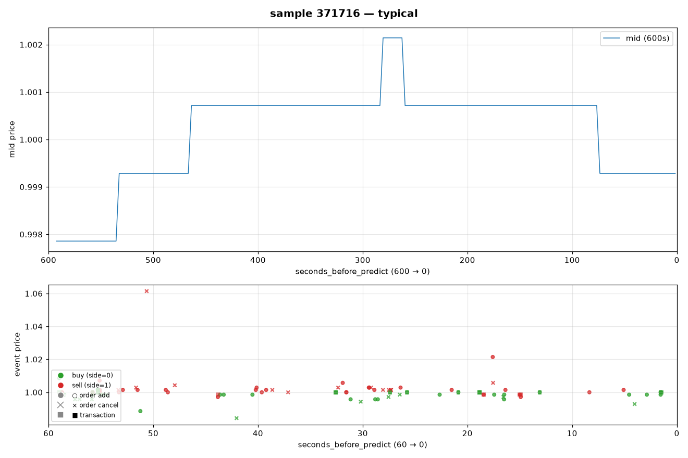
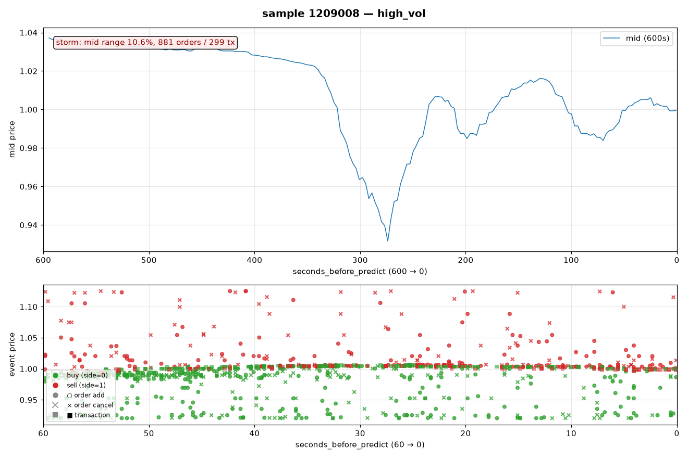
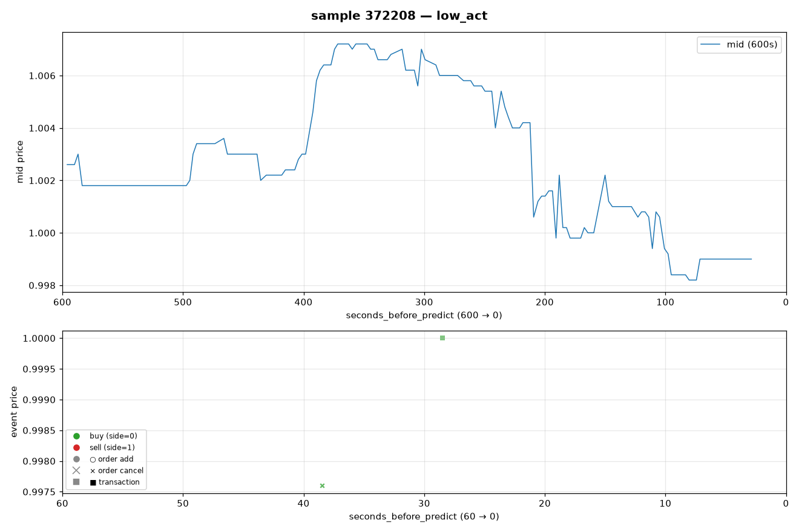
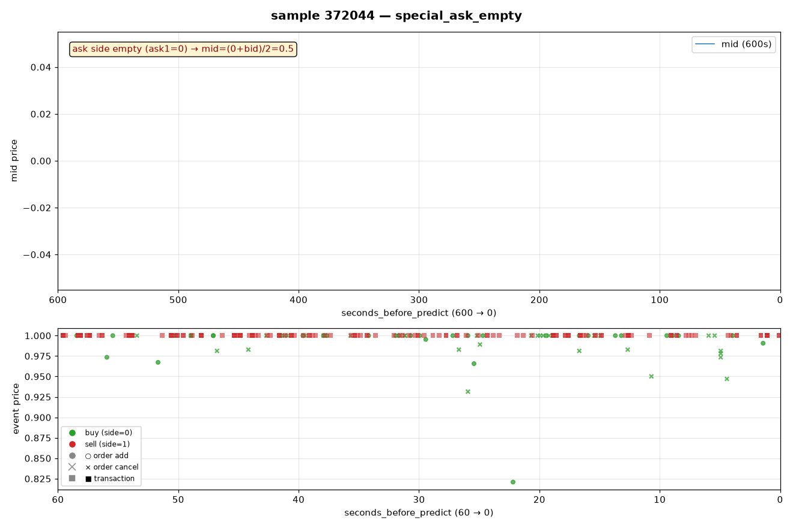

# MSCapital 数据集示例报告 — 用 4 个真实样本读懂数据

> 日期: 2026-08-15 | 数据: train 原始 feather
> 说明: 每个 `sample_id` = 一个 10 分钟市场窗口。下面用 4 个真实样本逐行展示数据长什么样。
> 统计背景见 `docs/eda-raw-2026-08-15.md`

> **图例速查** (所有样本图通用):
> - 上子图: 蓝色折线 = 600s mid 价格路径 (每 ~3s 一个 bar)
> - 下子图: 最后 60s 逐笔事件 — 绿 = 买 (side=0), 红 = 卖 (side=1); ○ = 挂单, × = 撤单, ■ = 成交

---

## 0. 一个样本的构成 (先建立整体图景)

每个样本由 4 块组成, 通过 `sample_id` 对齐:

```
                    预测时刻 T
                        │
market.feather  ────────┤  T-600s ── T   每 ~3s 一行 bar (盘口快照 + 成交聚合)
order.feather   ────────┤  T-60s ── T    逐笔订单事件 (挂单/撤单)
transaction     ────────┤  T-60s ── T    逐笔成交事件
label           T 之后                未来收益 target
```

`seconds_before_predict` 是倒计时: 数值越小越接近预测时刻, 0 = 预测瞬间。

---

## 1. 四个样本的身份卡

| 维度 | ①典型样本 | ②高波动样本 | ③超低活跃 | ④特殊状态(ask空) |
|---|---|---|---|---|
| sample_id | 371716 | 1209008 | 372208 | 372044 |
| month | 21 | 68 | 21 | 21 |
| **target (y)** | **+0.00021** | **−0.01729** | **−0.00510** | **0.00000** |
| 预测 p (frozen) | +0.883 | −6.269 | +0.153 | −1.896 |
| market bar 数 | 193 | 199 | 144 | 200 |
| 订单数 (60s) | 83 | **881** | **1** | 68 |
| 成交数 (60s) | 24 | **299** | **1** | **233** |
| mid_range (600s) | 0.0043 (0.4%) | **0.106 (10.6%!)** | 0.0090 | — (无有效报价) |

四个样本覆盖了数据集的四种"性格": 常态、风暴、死寂、异常。

---

## 2. ①典型样本 (sample 371716) — 市场的日常



**看图要点**:
- 上子图: mid 在 600s 内呈**阶梯状**跳变 (盘口报价变化是离散的), 总摆动 0.4%
- 下子图: 60s 内 83 笔订单 + 24 笔成交都挤在 mid ±0.5% 内; 远处孤立的高价卖单 (1.06) 是深挂单
- 绿点(买单)在最后 30s 明显增多 → 尾盘买盘活跃

### 2.1 market.feather 前 7 行 (原始数据)

| seconds | tx_avgprice | tx_volume | tx_count | ask_p1 | ask_v1 | bid_p1 | bid_v1 | ask_p2 | ask_v2 | bid_p2 | bid_v2 |
|---|---|---|---|---|---|---|---|---|---|---|---|
| 592.54 | 0.99857 | 1000 | 4 | 0.99857 | 165600 | 0.99714 | 100500 | 1.00000 | 172700 | 0.99571 | 67200 |
| 586.52 | **null** | 0 | 0 | 0.99857 | 165600 | 0.99714 | 100500 | 1.00000 | 172700 | 0.99571 | 67200 |
| 583.52 | 0.99714 | 200 | 1 | 0.99857 | 165600 | 0.99714 | 100300 | 1.00000 | 172700 | 0.99571 | 67200 |
| 580.52 | 0.99715 | 1602 | 2 | 0.99857 | 163300 | 0.99714 | 98698 | 1.00000 | 172700 | 0.99571 | 67200 |
| 577.51 | **null** | 0 | 0 | 0.99857 | 163300 | 0.99714 | 99098 | 1.00000 | 172700 | 0.99571 | 67200 |
| 571.52 | **null** | 0 | 0 | 0.99857 | 163300 | 0.99714 | 99298 | 1.00000 | 172700 | 0.99571 | 67200 |
| 568.51 | 0.99857 | 100 | 1 | 0.99857 | 163200 | 0.99714 | 99298 | 1.00000 | 172700 | 0.99571 | 67200 |

**逐列解读**:
- `seconds_before_predict=592.54` → 这个 bar 距预测时刻还有 592 秒 (约 10 分钟前)
- `tx_avgprice=0.99857` → 这 3 秒内成交均价 0.99857 (价格已匿名化到 1.0 附近)
- `tx_volume=1000, tx_count=4` → 3 秒内成交 1000 股, 分 4 笔
- **`tx_avgprice=null` 的 3 行** → 该 bar 内没有成交 (静默期)。全数据集中 ~31% 的 bar 无成交
- `ask_p1=0.99857 / bid_p1=0.99714` → 最优卖价/买价 (L1), spread = 0.00143 ≈ 0.14%
- `ask_v1=165600 / bid_v1=100500` → L1 挂单量 (16.6 万股 vs 10 万股) — **卖盘明显厚于买盘**
- `ask_p2=1.00000 / bid_p2=0.99571` → 次优档 (L2)
- 观察: bid_v1 从 100500 → 100300 → 98698 → 99098 缓慢变化 → 盘口在微量变动 (成交吃掉挂单)

### 2.2 盘口状态推算 (从上面数据能读出什么)

```
mid  = (0.99857 + 0.99714)/2 = 0.99786
spread = 0.00143 (0.14%)           ← 正常偏窄
depth imbalance = (100500-165600)/(100500+165600) = -0.24  ← 卖压 (ask 厚)
```

### 2.3 order.feather 前 10 行 (原始数据)

| seconds | price | volume | side | action | 含义 |
|---|---|---|---|---|---|
| 58.98 | 1.00857 | 100 | 0 | 0 | 买方向挂单 1.00857 (高于市价 → 追买) |
| 58.71 | 1.00000 | 100 | 1 | 0 | 卖方向挂单 1.0 |
| 58.50 | 0.99857 | 400 | 0 | 0 | 买方向挂 0.99857 (= 当前 best ask, 直接吃单) |
| 57.46 | 0.99571 | 400 | 0 | **1** | **撤掉** 0.99571 的买单 |
| 57.04 | 0.99571 | 300 | 0 | **1** | 再撤一笔买单 |
| 55.86 | 0.99571 | 500 | 0 | **1** | 连续撤单 (买盘在撤退) |
| 55.80 | 1.00000 | 400 | 0 | 0 | 新买单 1.0 |
| 55.79 | 0.99857 | 100 | 0 | 0 | 新买单 |
| 55.79 | 1.00000 | 100 | 1 | 0 | 新卖单 (同秒双事件) |
| 55.29 | 1.00143 | **8700** | 0 | 0 | **大买单 8700 股** (本地大单) |

**解读要点**:
- side: 0=买, 1=卖; action: 0=挂新单, 1=撤单
- 55-57 秒出现**连续撤买** → 买方在变弱 (与 target +0.0002 的微涨呼应: 撤单后价格微跌再企稳)
- 55.79 秒出现同秒多事件 (批量)
- 55.29 秒 8700 股大买单 → 有资金进场

### 2.4 transaction.feather 前 8 行

| seconds | price | volume | side |
|---|---|---|---|
| 58.98 | 1.00000 | 100 | 0 |
| 55.80 | 1.00000 | 400 | 0 |
| 55.29 | 1.00000 | 5100 | 0 |
| 55.29 | 1.00000 | 900 | 0 |
| 55.29 | 1.00000 | 100 | 0 |
| 55.29 | 1.00000 | 100 | 0 |
| 55.29 | 1.00143 | 2100 | 0 |
| 55.29 | 1.00143 | 400 | 0 |

**解读要点**:
- side=0 = 买方主动 (taker buy, 吃掉卖单)
- 55.29 秒连续 6 笔成交 → **同一时刻的批量成交** (一大笔买单被拆成多笔成交)
- 成交价从 1.00000 上移到 1.00143 → 买单在抬价扫货
- **和 order 流对照**: 55.29 的 8700 股大买单 → 55.29 的 5100+900+100+100+2100+400 = 8700 股成交! **完全对应**: 大单挂出后立即成交

### 2.5 三表时间线对齐 (同一时间轴)

```
T-60s                        T-55.3s                    T-58.98s      T
  │  撤单×3 (买撤退)   │  大买单 8700 → 立即成交 8700  │ 追买单      │
  └────────────────────┴──────────────────────────────┴─────────────┘
  market bar: bid_v1 持续减少 (挂单被吃)
```

**这就是数据的"动态故事"**: order 表说"有人要买", transaction 表说"真的买了", market 表说"盘口变薄了"。

---

## 3. ②高波动样本 (sample 1209008) — 市场风暴



**看图要点**:
- 上子图: mid 剧烈波动, 总摆动 **10.6%** (典型样本的 25 倍), 呈持续下行趋势
- 下子图: 事件密集到几乎无法分辨 (881 订单 + 299 成交), 价格散点从 0.92 拉到 1.12 — 深挂单远离 mid
- × (撤单) 数量明显多于典型样本 → 高波动期撤单频繁 (流动性脆弱)

### 3.1 与典型的差异

- target = **−0.0173** (跌 1.7%!, 是典型样本的 80 倍幅度)
- 订单 881 笔 (典型 10 倍), 成交 299 笔 (典型 12 倍)
- mid_range = **0.106** = 价格在 600s 内摆动 10.6% (典型 0.4% 的 25 倍!)
- month 68 — 注意: m68 恰是全局波动最高的月份 (std 5.0e-3)

### 3.2 order 流片段 (注意价格极端)

| seconds | price | volume | side | action |
|---|---|---|---|---|
| 59.83 | 0.99898 | 1100 | 1 | 0 |
| 59.83 | **1.02041** | 1500 | 1 | 0 |
| 59.82 | 0.98469 | 300 | 0 | 0 |
| 59.82 | **1.02279** | 500 | 1 | 0 |
| 59.81 | 0.97959 | 2000 | 0 | 0 |
| 59.81 | **1.12415** | 500 | 1 | **1** |
| 59.57 | 0.98639 | 100 | 0 | 0 |
| 59.56 | 0.98844 | 200 | 0 | 0 |
| 59.56 | **0.92041** | 100 | 0 | 0 |
| 59.56 | **1.10884** | 100 | 1 | **1** |

**解读**:
- 价格范围 0.92~1.12 → **市场已经极度恐慌**, 限价单挂到远离 mid 的深度 (深档)
- 0.92 的买单 vs 1.12 的卖单 → 盘口宽度巨大, 流动性崩坏
- 高波动样本的订单价格离 mid 很远 (典型样本都在 mid ±1% 内) → **这就是 GPT 说的 aggressiveness 差异的直观例子**

### 3.3 成交流片段

```
59.57: 0.98980 × 100 (买)
59.56: 0.98980 × 700 (买)
59.56: 0.98980 × 1600 (买)
59.06: 0.98980 × 100
59.06: 0.99014 × 200
59.06: 0.99320 × 3300
```

- 价格一路下跌 (0.993 → 0.990 → 0.990), 成交量放大 → **恐慌性抛售+买盘承接**
- 这是"风暴"样本: 高活动度 + 大波动 + 强趋势 (与 EDA 的 corr(活动度,|y|)=+0.2 呼应)

---

## 4. ③超低活跃样本 (sample 372208) — 死寂市场



**看图要点**:
- 上子图: 600s 内 mid 呈长平台 + 少数跳变 — 大部分时间盘口纹丝不动
- 下子图: **几乎空白** — 只有 1 个 × (撤单) 和 1 个 ■ (成交)
- 对比: 事件流空了, 但 target 仍有 −0.5% → 价格变化发生在更早的历史里

### 4.1 全量数据 (就这么点)

**order.feather (全表 1 行)**:
| seconds | price | volume | side | action |
|---|---|---|---|---|
| 38.47 | 0.99760 | 200 | 0 | 1 |

→ 60 秒内只有**一笔撤单** (200 股买单被撤)

**transaction.feather (全表 1 行)**:
| seconds | price | volume | side |
|---|---|---|---|
| 28.50 | 1.00000 | 600 | 0 |

→ 只有一笔 600 股成交 (买方主动)

**market.feather**: 144 行 (比典型少 50 行 → 静默期更长, bar 被跳过)

### 4.2 解读

- 这是数据集的"长尾"之一: **1.26M 样本中约 3.5% 订单数 ≤ 5**
- 尽管 60s 几乎无事件, target 仍有 −0.0051 (0.5% 跌幅!) → **事件流稀疏 ≠ 价格不动**; 价格变化可能发生在 600s 历史里, 或信息根本不在事件流中
- 对建模的启示: 这类样本 152 特征几乎全是 0/常数 → 模型只能靠 market 600s 状态判断 (这解释了为什么 market 序列对这类样本重要)

---

## 5. ④特殊状态样本 (sample 372044) — ask 全空的异常



**看图要点**:
- 上子图: mid 恒等于 **0.5** — 因为 ask 侧全空 (ask1=0), mid=(0+1)/2 被钉死
- 下子图: 事件全部发生在价格 1.0 — 绿点(买单)挂 1.0, 红方块(卖单)在 1.0 成交
- 直观看到 "0.5 价簇" 的来源: 不是价格真跌到 0.5, 而是**单边盘口的计算假象**

### 5.1 market.feather 的诡异之处

| seconds | ask_p1 | ask_v1 | bid_p1 | bid_v1 |
|---|---|---|---|---|
| 596.8 | **0.0** | **0** | **1.00000** | **12,794,116** |
| 593.8 | 0.0 | 0 | 1.00000 | 12,794,216 |
| ... | ... | ... | ... | ... (200 行全部如此) |

- **ask 侧全部为空 (0 价格哨兵)**, 买单在 1.0 挂了 **1279 万股** (典型样本的 100 倍深度!)
- mid = (0+1)/2 = **0.5** → 这就是取证发现的"0.5 价簇"样本 (0.76%)
- 这类样本疑似**第二标的** (价格按不同基准归一化) 或**极端单边状态** (涨跌停/停牌式)

### 5.2 order 流全是买单, 成交全是卖单

order: 全部 side=0 (买), 在 0.97~1.0 挂大单, 其中大量撤单 (如 48.94 秒撤掉 **199,200 股**!)
tx: 全部 side=1 (卖), 在 1.0 疯狂成交 (59.59 秒连续 8 笔)

**解读**: 这是"单一价格吸收"状态 — 卖盘在 1.0 无限量抛售, 买盘用超大挂单承接。y=0.00000 (精确零值!) — 5.5% 零 target 中的一员, 可能因为价格被钉在 1.0 不动。

### 5.3 对建模的启示

- 这类样本的 mid/spread/imb 计算**全部失效** (ask=0) → 需要 0 价格哨兵过滤 (缺口 B, 已识别)
- 模型给它的预测 p=−1.90 (强烈看跌) 但真实 y=0 → 这类样本可能是系统性误预测源

---

## 6. 字段速查表

| 表 | 字段 | 类型 | 含义 | 注意 |
|---|---|---|---|---|
| label | month | int16 | 月份 0-70 | 顺序时间轴 |
| | sample_id | int32 | 样本 ID | 三表对齐键 |
| | target | float | 未来收益 | mean≈0, std 2.6e-3, 5.5% 精确零 |
| market | seconds_before_predict | float | 距预测秒数 (600→0) | 约 3s 一跳 |
| | transaction_avgprice | float | bar 内成交均价 | **31% 为 null** (无成交) |
| | transaction_volume/count | int | bar 内成交量/笔数 | 0 与 null 共存 |
| | ask/bid_price_1, ask/bid_volume_1 | float/int | L1 最优档 | **0 = 该侧空档** |
| | ask/bid_price_2, ask/bid_volume_2 | float/int | L2 次优档 | 同上 |
| order | price/volume | float/int | 委托价/量 | 价格可离 mid 很远 (深挂) |
| | side | int8 | 0=买, 1=卖 | 51%/49% |
| | order_action | int8 | 0=挂新单, 1=撤单 | 75%/25% |
| transaction | price/volume | float/int | 成交价/量 | 只在 mid ±1.1% 内 |
| | side | int8 | 0=买方主动, 1=卖方主动 | 48%/52% |

## 7. 从 4 个样本学到的建模要点

1. **同秒批量事件** (55.29s 六连成交) 是常态 → micro-batch 聚合可能携带策略信息 (GPT 机会 C)
2. **大单挂出立即成交** (8700 股) → order→tx 的即时响应关系肉眼可见, 事件级 lag 特征有物理基础 (GPT 机会 B)
3. **撤单是情绪风向标** (典型样本连续撤买后价格走弱) → cancel 信息值得精细建模 (152 已有部分)
4. **高波动样本事件密集但价格极端** → 活动度是 regime 标记, 不是方向信号
5. **超低活跃样本事件流空转** → 这类样本必须靠 market 600s 状态 (序列建模的用武之地)
6. **特殊状态样本会污染统计特征** → 0 价格哨兵过滤是卫生底线 (缺口 B)

---

## 附: 复现

```bash
cd /d/mscapital-kaggle && export PYTHONPATH= && ./.venv/Scripts/python.exe scripts/eda_sample_report.py
# 输出 output/eda/sample_report_data.json (4 样本完整明细)
```
